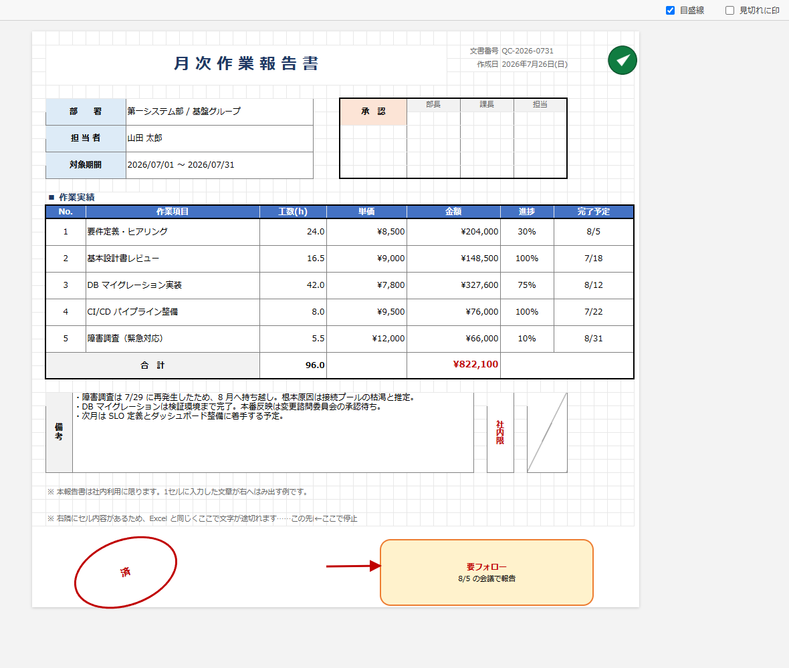

# xlsx2html-houganshi — Excel 方眼紙 → 見た目そのまま HTML 変換器

> Convert Japanese-style "graph paper" Excel documents (Excel 方眼紙) into a single
> self-contained HTML file that looks the same, with selectable and searchable text.

目の細かい「Excel 方眼紙」ドキュメントを、**見た目を保ったまま**単一の HTML に変換します。
数式は保存済みの計算結果に置き換わりますが、文字はすべて実テキストなので選択・コピー・全文検索ができます。



*（`make_sample.py` が生成するサンプルを変換したもの。結合セル・罫線・表示形式・縦書き・斜線・
はみ出し文字・画像・オートシェイプを含みます）*

```
python xlsx2html.py 入力.xlsx                 # 入力.html を隣に出力
python xlsx2html.py 入力.xlsx -o 出力.html
python xlsx2html.py 入力.xlsx --print-area     # 印刷範囲だけを切り出す
```

依存は `openpyxl` のみ。出力は画像も base64 で埋め込んだ**1ファイル完結**なので、そのまま配布・共有できます。

## 動作環境

- Python 3.9 以上
- openpyxl 3.1 以上（`pip install -r requirements.txt`）

Windows / macOS / Linux で動きます。Excel はインストールされていなくても構いません。

## 再現するもの

| 項目 | 内容 |
| --- | --- |
| 方眼のインデント | 列幅・行高を px に換算（既定幅 8.43 → 64px）し、`table-layout:fixed` で厳密に固定。**セル位置は 1px 単位で一致** |
| 罫線 | 上下左右それぞれの線種（細/中/太/点線/破線/二重/斜線）と色 |
| 塗り | 単色・テーマ色・パターン（濃淡は近似）・tint |
| フォント | 書体・サイズ・太字・斜体・下線・打ち消し・色・上付き/下付き |
| 配置 | 左右中央/上下・インデント・折り返し・**縦書き**・角度指定の回転 |
| 結合セル | `rowspan` / `colspan` として出力 |
| 数式 | INDEX / MATCH / XLOOKUP / LOOKUP / INDIRECT なども含め、**Excel が保存した計算結果をそのまま表示**（再計算はしない）。`CELL("filename")` でシート名を出す式だけは例外的に解決する |
| 表示形式 | 日付（`yyyy"年"m"月"d"日"(aaa)`、和暦 `ggge"年"m"月"d"日"` / `ge.m.d`）、時刻（`h:mm`）、経過時間（`[h]:mm`、`[h]"時間"mm"分"`）、金額・桁区切り・小数・パーセント・条件付きセクション（`[赤]-#,##0` など）。日本語版 Excel の組み込み書式（`numFmtId` 27〜36 / 50〜58）にも対応 |
| はみ出しと見切れ | Excel と同じ挙動。**隣が空セルなら右へはみ出し、文字が入っていればそこで切れる**。折り返しセルは行の高さで下が切れる |
| セル内一部書式 | 同一セル内で一部だけ太字・色違い（リッチテキスト） |
| 条件付き書式 | セルの値・文字列・空白・エラー・重複/一意・上位下位・平均より上下・日付、および**数式ルール**（`=$E5="完了"` や `=MOD(ROW(),2)=1` など）を判定して塗り・文字色・罫線に反映。**カラースケール・データバー・アイコンセット**も再現 |
| 画像 | 埋め込み画像を base64 で配置（EMF/WMF は非対応のため省略） |
| オートシェイプ | 四角・角丸・楕円・三角・矢印・線・コネクタ・吹き出し等を CSS/SVG で再現。ブロック矢印と**カギ線コネクタ**は OOXML の調整値（折れ位置・軸の太さ・矢尻の長さ）に従う。図形内テキスト・回転・反転・矢尻の種類/大きさつき |
| 印刷設定 | 用紙サイズ・向き・余白を `@page` に反映。手動改ページ、印刷タイトル行（各ページで見出しを繰り返す）、`fitToWidth`／拡大縮小率も反映。目盛線は Excel と同じく印刷されない |
| その他 | 複数シート（タブ切替）、非表示行列、ハイパーリンク、コメント（マウスオーバー表示） |

## 見切れた文字の扱い

Excel と同じ位置で文字を切りますが、**切った文字も HTML には残しています**。したがって

- 範囲選択してコピーすれば、画面に見えていない部分も含めてコピーされる
- ブラウザの Ctrl+F で見えていない文字も検索できる

さらに、

- **見切れているセルをクリック**すると全文が表示され、もう一度クリックで元に戻ります（Esc で全部閉じる）。
  クリックとドラッグは区別しているので、範囲選択の操作では開きません
- 右上の**「見切れに印」**をオンにすると、切れているセルの端に細い赤線が付き、どこが切れているか一目で分かります

## 目盛線

Excel の目盛線（薄いグレーの線）は、Excel 側の「目盛線の表示」設定に従って描画します。

- 右上の**「目盛線」**チェックボックスで、閲覧時に表示／非表示を切り替えられます（切っても方眼の位置はずれません）
- **印刷には出ません。** Excel と同じく、シート側で「枠線を印刷する」を有効にしている場合だけ印刷されます
- 最初から出力しないようにするには `--gridlines off` を指定します

Excel は目盛線を「下に敷いてから、その上にセルを描く」ので、次の場合は目盛線が見えなくなります。
本ツールも同じように消します。

- **塗りつぶしのあるセル**（罫線が無くても）— 塗りが目盛線を覆う。条件付き書式による塗りも同じ
- **はみ出した文字が通ったところ** — 文字が届く範囲の縦線が消える。
  どこまで届くかはフォント次第なので、**ブラウザ側で実測してから**消しています

## オプション

| オプション | 既定 | 説明 |
| --- | --- | --- |
| `-o, --output` | 入力と同名 .html | 出力先 |
| `--sheet 名前` | 全シート | 変換するシートを 1 枚に限定 |
| `--print-area` | — | 印刷範囲が設定されているシートは、その範囲だけを出力する |
| `--gridlines auto\|on\|off` | `auto` | 目盛線。auto は Excel 側の「目盛線の表示」設定に従う。`off` で最初から出力しない |
| `--formula-tips` | — | 数式セルにマウスを乗せると数式を表示する |
| `--show-formula` | — | 計算結果が保存されていない数式セルに、数式そのものを表示する |
| `--no-drawings` | — | 画像・図形を出力しない（軽量化） |
| `--no-cond-format` | — | 条件付き書式を反映しない |
| `--no-page-setup` | — | 用紙・余白・改ページの反映をやめる |
| `--hidden-sheets` | — | 非表示シートも出力する |
| `--no-formula-check` | — | 数式の走査を省略して高速化する |
| `--diagnose` | — | 変換せず、数式まわりの状態だけを調べて表示する（後述） |
| `--max-cols` / `--max-rows` | 1024 / 20000 | 巨大シートの保険 |

## 数式について

数式は**再計算しません**。xlsx に保存されている計算結果（Excel が保存時に書き込む値）を読んで表示します。
Excel で作って保存したファイルなら、XLOOKUP でも INDIRECT でも結果はそのまま出ます。

計算結果が保存されていないファイル（一部の外部ツールが出力した xlsx など）では、そのセルが空欄になります。
その場合は変換時に「計算結果なしの数式 N 個」と警告が出ます。対処は次のいずれかです。

1. Excel で開いて上書き保存する（推奨。これで全セルに結果が保存されます）
2. `--show-formula` を付けて、数式そのものを表示する

### シート名を表示する式（`CELL("filename")`）

`=RIGHT(CELL("filename",A1),LEN(CELL("filename",A1))-FIND("]",CELL("filename",A1)))`
でシート名を表示する定番の式は、**保存されている計算結果が `#VALUE!` になっていることがあります**。
`CELL` は揮発性関数で Excel は開くたびに再計算しますが、保護ビュー（「編集を有効にする」が
出ている状態）ではファイルのパスを取得できず、そのエラーがそのまま保存されるためです。
Excel の画面には出ないエラーなので、本ツールは変換時にシート名へ解決します。

- 対象は**保存されている値がエラーのときだけ**です。本物の `#REF!` や `#N/A` はそのまま表示します
- `[` と `]` の間を取り出す形（ブック名）にも対応します
- そのセルを参照しているだけのセル（目次の各行など）や、`="("&'14.2.用紙'!$A$1&"に記載)"`
  のような文字列連結にも波及させます
- フォルダのパスを取り出す形は、**変換した環境のパスが出てしまう**ため解決しません

### 日付・時刻の計算

日付や所要時間の計算（`=開始+所要時間` など）も、他のセル参照と同じく Excel が保存した結果を
そのまま表示します。値そのものは正しくても、**表示形式の解釈を間違えると別物に見える**ため、
そこは実装側で合わせてあります。

- `h:mm` の `mm` は「月」ではなく「分」として出します（`yyyy/m/d h:mm`、`mm:ss` なども同様）
- 和暦の `ggge` / `gge` / `ge` は元号名と年をまとめて出します（`令和8年`、`R8`）
- 日本語版 Excel が使う組み込み書式 `numFmtId` 27〜36 / 50〜58（`yyyy"年"m"月"d"日"`、
  `h"時"mm"分"`、`[$-411]ge.m.d` など）は xlsx に書式の定義が入らないため、
  対応表を内蔵しています。これが無いと日付が `46255` のようなシリアル値のまま表示されます

### 値が Excel と違うときの調べ方（`--diagnose`）

```
python xlsx2html.py 入力.xlsx --diagnose
```

変換はせず、数式まわりの状態だけを表示します。**セルの中身（値や文字列）は一切出力しません。**
出るのは件数と、関数名・セル番地だけなので、機密ファイルでもそのまま実行して結果を共有できます。

分かること:

- 作成アプリ（Excel 以外の生成物かどうか）、`fullCalcOnLoad` / 手動計算の有無、`calcChain` の有無
- 数式セル数、計算結果が保存されていないセル数、エラー値のセル数
- **縦に連続する数式セルの保存値が同一になっている区間** —
  連番や累計が「同じ値ばかり」に見える場合、その多くは xlsx に保存された計算結果自体が古いことが原因です
- **表示形式の解決状況** — 日付として読めたセル数と、日付が数値のまま残っているセルの `numFmtId`。
  日付が `46255` のようなシリアル値で出てしまう場合はここに `numFmtId` が出ます

保存値が古いと判明した場合は、Excel で開いて上書き保存してから変換し直してください。

## 条件付き書式

Excel のルールを評価して、塗り・文字色・太字・罫線・表示形式に反映します。

| ルール | 対応 |
| --- | --- |
| セルの強調（`cellIs`） | `=` `<>` `<` `>` `<=` `>=` `between` `notBetween` |
| 文字列 | 含む／含まない／で始まる／で終わる |
| 空白・エラー | `containsBlanks` / `notContainsBlanks` / `containsErrors` / `notContainsErrors` |
| 重複・一意 | `duplicateValues` / `uniqueValues` |
| 上位下位 | `top10`（上位/下位 N 件・N %） |
| 平均より上下 | `aboveAverage`（標準偏差の指定を含む） |
| 日付 | 今日・昨日・明日・過去 7 日間・今週/先週/来週・今月/先月/来月 |
| 数式ルール | `=$E5="完了"` `=AND($A5<>"",$B5="")` `=MOD(ROW(),2)=1` など。相対参照はルール範囲の左上を基準にずらして評価します |
| カラースケール | 2 色・3 色（`min` / `max` / `num` / `percent` / `percentile` / `formula`） |
| データバー | 長さを CSS グラデーションで再現（「値を表示しない」設定にも対応） |
| アイコンセット | 矢印・信号・記号・フラグ・星・四分円・評価バーなどを SVG で描画 |

- 優先順位（`priority`）の順に評価し、`stopIfTrue` も尊重します
- 数式ルールで使える関数は条件付き書式でよく使うものに限ります。
  評価できない式（`VLOOKUP` など未対応の関数を含むもの）は、そのルールを**不成立**として扱い、
  変換時に件数と式を警告します
- 日付ルールは**変換した日**を基準に判定します
- `--no-cond-format` で反映をやめられます

## 使いどころ

- 仕様書・パラメータシート・報告書を、Excel なしで閲覧できるようにする
- ブラウザの印刷（Ctrl+P）でそのまま PDF 化する（Excel の用紙・余白・改ページ設定を引き継ぎます）
- 全文検索・差分比較・Git 管理のためにテキスト化する

フォルダ一括変換（PowerShell）:

```powershell
Get-ChildItem *.xlsx | ForEach-Object { python xlsx2html.py $_.FullName }
```

## 既知の制限

- **グラフ・SmartArt** は描画されません（枠も出しません）
- 条件付き書式の数式ルールは簡易評価です。`VLOOKUP` / `INDIRECT` / 名前定義などを含む式は判定できず、
  そのルールは不成立になります（変換時に件数を警告します）
- 自動の改ページ位置は計算しません。反映するのは Excel に保存された**手動の改ページ**だけです
- 縦の改ページ（列方向の改ページ）は HTML の表では表現できないため無視します
- 数値がセル幅に収まらない場合、Excel は `###` を表示しますが、本ツールは**値をそのまま表示**します
  （変換結果として値が読めなくなるほうが不便なため。隣にセル内容があれば従来どおりそこで切れます）
- 組み込み表示形式 `numFmtId` 27〜36 / 50〜58 の意味はロケール依存です。本ツールは**日本語ロケールの
  対応表**を使うため、中国語・韓国語版 Excel で作られたファイルでは日付の書きぶりが異なることがあります
- 旧 `.xls` およびパスワード保護／IRM 付きファイルは読めません（Excel で `.xlsx` として保存し直してください）
- ヘッダー／フッターの文字列は出力しません

## ファイル

- `xlsx2html.py` — 変換器本体（依存は openpyxl のみ）
- `make_sample.py` — 検証用の方眼紙サンプル（`sample_houganshi.xlsx`）を生成。結合セル・罫線・表示形式・縦書き・斜線・はみ出し文字・画像・図形・印刷設定を一通り含みます
- `sample_houganshi.xlsx` — 上記サンプル。`python xlsx2html.py sample_houganshi.xlsx` で変換結果を確認できます

## ライセンス

MIT License — [LICENSE](LICENSE) を参照してください。
